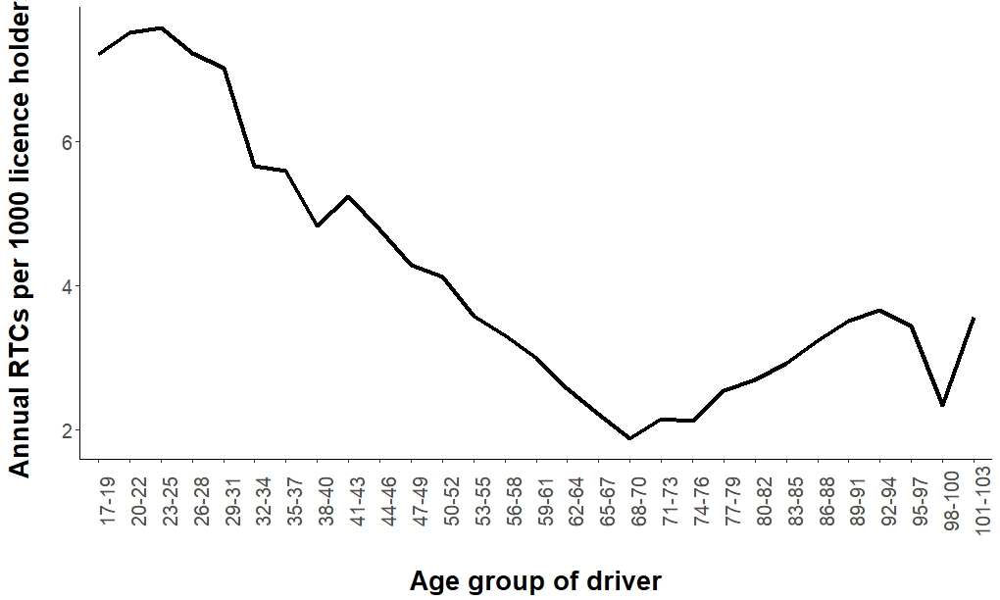
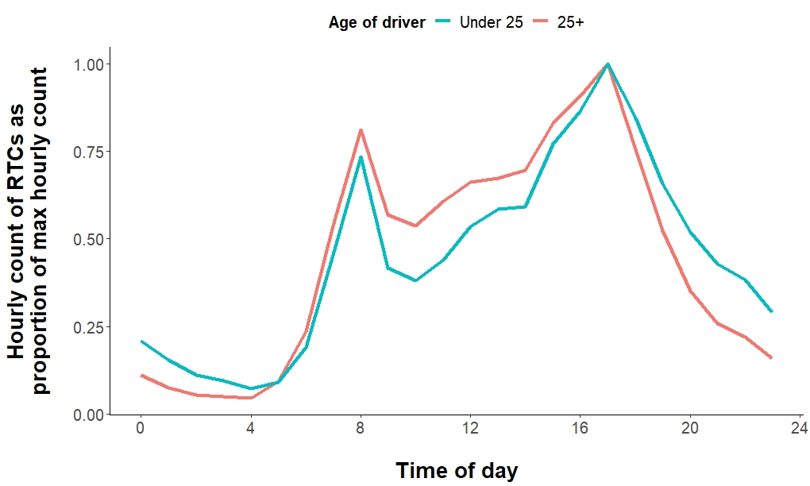
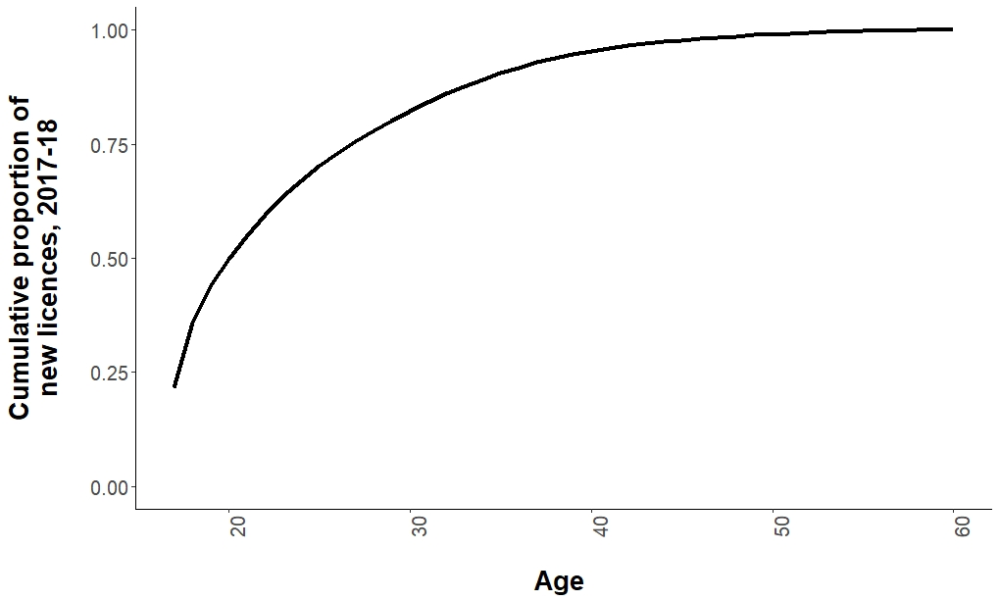

The Department for Transport recently announced that they were considering introducing graduated driver licences which potentially could see [new drivers banned from driving at night](https://www.bbc.co.uk/news/uk-49026171). There is strong evidence that new drivers are at greater risk of involvement in a collision than more experienced drivers (e.g. [this review paper by Williams](https://www.sciencedirect.com/science/article/pii/S0022437502000750)), hence consideration of graduated licences. One proposed approach to these graduated licences is to ban new drivers from driving at night. Presumably the logic behind such a proposal is that new drivers are at heightened risk of involvement in a collision at night, particularly compared to other, more experienced drivers.  
 

**STATS19 data**

In this post I provide some quick-and-dirty analysis about night-time risk for new drivers. Well, I say new drivers, but I actually look at young drivers, under the assumption that the vast majority of new drivers are also young drivers. I've used the stats19 R package created by Robin Lovelace and others to access road traffic collision (RTC) data from, er, STATS19, (the UK's national database of police-recorded collisions resulting in an injury). I've looked at 3 years of data between 2015 and 2017. All code for this analysis is [available here](https://github.com/JimUttley/STATS19_analysis/blob/master/Young_drivers_risk.R).

Comparing the number of RTCs by driver age group against the number of licence holders in those age groups appears to confirm the increased likelihood younger drivers will be involved in an RTC (see <a href="#fig1">Figure 1</a>). It should be noted though that comparing RTCs frequencies against the number of licence holders does not account for possible differences between age groups in the amount of driving they do. It is possible, for example, that younger people drive more than older people, increasing their exposure to risk of an RTC.

A reference to the <a href="#image">image</a>.

<figure>
  
  <figcaption>
    <strong>Figure 1.</strong> Annual RTCs per 1,000 licence holders, by age group of driver involved in RTC. Annual RTC values based on average between 2015 and 2017. Licence holder numbers from November 2017, <a href="https://data.gov.uk/dataset/d0be1ed2-9907-4ec4-b552-c048f6aec16a/gb-driving-licence-data">DfT table D0101</a>
  </figcaption>
</figure>

**Temporal distribution of RTCs**

To look at driving risk by age I have split the age of drivers into two categories - younger drivers (aged under 25), who also represent new drivers, and older drivers (aged 25+). <a href="#fig2">Figure 2</a> shows the temporal distribution of RTCs for young and older drivers across a 24 hour day. The RTC hourly frequencies have been calculated as a proportion of the maximum hourly frequency, which for both age groups is 17:00-17:59. The plot shows an RTC involving a young driver is more likely to happen later at night or early morning, compared with those involving an older driver. On the face of it, this seems to suggest young drivers are at greater risk when driving in the late hours compared with older drivers. 

<figure>
  
  <figcaption>
    <strong>Figure 2.</strong> Hourly counts of RTCs by age group of driver, as a proportion of the maximum hourly count.
  </figcaption>
</figure>

 
 

**Daylight vs Darkness**

The proposal apparently being considered by the Government refers to driving at night, rather than driving after a certain time of day. I therefore considered the light conditions of the RTC and whether it happened in daylight or after-dark, as reported in the STATS19 record. Table 1 shows that 32% of RTCs involving a young driver happened when it was dark, compared with 24% of RTCs involving an older driver. This appears to confirm an increased likelihood of involvement in an RTC after-dark for young drivers, relative to older drivers. However, it again does not account for exposure levels. If young drivers do drive more frequently and for greater lengths of time when it is dark compared with older drivers, this would partly explain a greater proportion of RTCs occurring in dark conditions. Without data about driving rates at different times of day and by different age groups, it is hard to say whether the larger proportion of after-dark RTCs for young drivers does indeed reflect a greater risk at night. However, there is some evidence that age influences the times at which people choose to drive. For example, a number of studies including [this one by Ball et al (1998)](https://www.ncbi.nlm.nih.gov/pubmed/9663290) suggest older drivers self-regulate their driving behaviour and restrict the amount they drive at night. Such behaviour could reduce exposure to RTCs after-dark for older drivers.

<table class="tg">
  <caption><strong>Table 1.</strong> Proportion of RTCs in daylight and dark conditions by age group of driver, for all RTCs between 2015 and 2017.</caption>
  <tr>
    <th class="tg-0pky" colspan="2" rowspan="2"></th>
    <th class="tg-7btt" colspan="2">Age group of driver</th>
  </tr>
  <tr>
    <td class="tg-7btt">Young drivers (&lt; 25 years)</td>
    <td class="tg-7btt">Older drivers (25+ years)</td>
  </tr>
  <tr>
    <td class="tg-kiyi" rowspan="2">Light conditions during RTC</td>
    <td class="tg-fymr">Daylight</td>
    <td class="tg-c3ow">68%</td>
    <td class="tg-c3ow">76%</td>
  </tr>
  <tr>
    <td class="tg-fymr">Darkness</td>
    <td class="tg-c3ow">32%</td>
    <td class="tg-c3ow">24%</td>
  </tr>
</table>

 

**Isolating the effect of darkness**

One approach we have used in past work to try and control for exposure effects whilst examining the effects of light condition (e.g. [this paper looking at the risk of an RTC after-dark at pedestrian crossings](https://www.sciencedirect.com/science/article/pii/S0001457517303202)) is by counting RTCs in a specific hour of the day, e.g. 18:00-18:59. This hour is chosen so that for part of the year it is in daylight, and for the rest of the year it is in darkness. Counting only RTCs in a specific hour attempts to control for other factors related to the time of day that might influence risk of an RTC, therefore isolating the effect of the ambient light condition. Various conditions that influence RTC risk are likely to change with time of day, including the light condition, such as driving behaviours, traffic conditions and volumes, and types of drivers on the roads.

We can compare the odds of an RTC occurring in the Case hour when it is in darkness versus daylight for young drivers and compare this against the same odds for older drivers, to produce an odds ratio. This effectively shows whether the risk of an RTC after-dark for young drivers is greater than for older drivers. I’ve calculated this odds ratio using Equation $\eqref{eq:OR}$. An odds ratio significantly greater than one would indicate greater risk after-dark for young drivers, compared with older drivers.

\begin{equation}
  OddsRatio = \frac{YoungRTC_{dark}/YoungRTC_{day}}{OldRTC_{dark}/OldRTC_{day}}
\label{eq:OR}
\tag{1}
\end{equation}

 

I used 18:00-18:59 as my ‘Case’ hour. I filtered the RTC records from STATS19 between 2015 and 2017 to only include those that occurred in this hour. I used the time of sunset at the location and on the date of the RTC to define whether it occurred in darkness or daylight. Time of sunset was calculated using the [‘suncalc’ R package](https://cran.r-project.org/package=suncalc) by Thieurmel and Elmarhraoui. RTCs were defined as occurring in darkness if they happened after the time of sunset, and defined as occurring in daylight if they happened before the time of sunset. I recognise this is a fairly crude way to assign the ambient light condition at the time of the RTC - it will not be completely dark immediately after sunset, and equally the light condition may have been deteriorating before the time of sunset. However, for the purposes of this analysis, a crude distinction between daylight and dark conditions was acceptable. I have defined the ambient light conditions in relation to the time of sunset in this way, rather than using the light condition field that already exists in the STATS19 records, to provide a more objective and comparable definition of the light at the time of the RTC.

Table 2 shows the counts of RTCs by their ambient light condition and the age group of the driver. Using these counts and Equation 1, the odds ratio of young drivers crashing after-dark versus daylight, compared with older drivers, is 0.94 (95% confidence interval = 0.91-0.97).

<table class="tg">
  <caption><strong>Table 2.</strong> RTC counts 2015-2017 during the Case hour of 18:00-18:59, by age group of driver and whether RTC occurred in daylight or darkness (defined as before or after sunset).</caption>
  <colgroup>
<col style="width: 230px">
<col style="width: 75px">
<col style="width: 186px">
<col style="width: 176px">
</colgroup>
  <tr>
    <th class="tg-0pky" colspan="2" rowspan="2"></th>
    <th class="tg-7btt" colspan="2">Age group of driver</th>
  </tr>
  <tr>
    <td class="tg-7btt">Young drivers (&lt; 25 years)</td>
    <td class="tg-7btt">Older drivers (25+ years)</td>
  </tr>
  <tr>
    <td class="tg-kiyi" rowspan="2">Light conditions during RTC (based on time of sunset on date and at location of RTC)</td>
    <td class="tg-fymr">Daylight</td>
    <td class="tg-c3ow">9.069</td>
    <td class="tg-c3ow">20,329</td>
  </tr>
  <tr>
    <td class="tg-fymr">Darkness</td>
    <td class="tg-c3ow">7,363</td>
    <td class="tg-c3ow">17,574</td>
  </tr>
</table>

 

This odds ratio of 0.94 suggests that rather than the risk after-dark for young drivers being greater than for older drivers, the after-dark risk is actually slightly lower for young drivers compared with older drivers. 
 
 

**Confounding between young and new drivers?**

In this analysis I have used young drivers as a proxy definition for new drivers, and have defined young drivers as being aged 24 or under. Using this definition, young drivers would have a maximum of 7 years driving experience, if they were aged 24 and had passed their test at 17. Perhaps 7 years of driving experience does not qualify someone as a ‘new driver’, and a graduated licence scheme is likely to only apply for the first one or two years after someone initially passes their test. However it is still reasonable to assume young drivers are also relatively new drivers - see <a href="#fig3">Figure 3</a>. This shows the number of new licences issued in 2017/18 by age of the new driver, as a cumulative percentage. Two thirds of people issued with a new licence were aged 24 or under, which suggests dichotomising the data into young and older driver groups as I have done is a reasonable way of capturing new, inexperienced drivers.

<figure>
  
  <figcaption>
    <strong>Figure 3.</strong> Cumulative proportion of new driving licences issued in 2017/18, by age of recipient. <a href="https://www.gov.uk/government/statistical-data-sets/driving-test-statistics-drt">Data from Table DRT0203</a>
  </figcaption>
</figure>
 

Ok, but let’s assume the odds ratio we calculated above is being confounded by drivers in their early and mid-twenties, who fall into my ‘young’ age group of drivers but who may have a number of years experience of driving and are pulling down the after-dark risk of this young age group. To check this, we can change the age threshold for our young and older age groups and calculate the odds ratio again. If we now call only drivers aged under 20 ‘young’, and anyone aged 20 and over as ‘older’, we can be more sure our young drivers are also new drivers, having a maximum of just two years of driving experience. Table 3 shows the RTC counts using this new threshold of young and older drivers. The associated odds ratio is 0.93 (95% confidence interval = 0.89-0.97) - virtually the same as when using 25 as the age threshold for the young and older age groups.
 

<table class="tg">
  <caption><strong>Table 3.</strong> RTC counts 2015-2017 during the Case hour of 18:00-18:59, by age group of driver (under 20 years or 20+ years) and whether RTC occurred in daylight or darkness (defined as before or after sunset).</caption>
  <colgroup>
<col style="width: 230px">
<col style="width: 75px">
<col style="width: 186px">
<col style="width: 176px">
</colgroup>
  <tr>
    <th class="tg-0pky" colspan="2" rowspan="2"></th>
    <th class="tg-7btt" colspan="2">Age group of driver</th>
  </tr>
  <tr>
    <td class="tg-7btt">Young drivers (&lt; 20 years)</td>
    <td class="tg-7btt">Older drivers (20+ years)</td>
  </tr>
  <tr>
    <td class="tg-kiyi" rowspan="2">Light conditions during RTC (based on time of sunset on date and at location of RTC)</td>
    <td class="tg-fymr">Daylight</td>
    <td class="tg-c3ow">5,642</td>
    <td class="tg-c3ow">23,756</td>
  </tr>
  <tr>
    <td class="tg-fymr">Darkness</td>
    <td class="tg-c3ow">4,506</td>
    <td class="tg-c3ow">20,431</td>
  </tr>
</table>

 

**Conclusion**

What conclusion to draw from this analysis? For me, I need more persuading that young (new) drivers are at noticeably greater risk driving after-dark than any other group of drivers. A superficial examination of the stats suggests young drivers are involved in more RTCs after-dark than older drivers, but this does not account for potential differences in exposure. It seems plausible that young people are more likely to drive at night than older people, which might explain why they have more collisions at night. This is not the same as suggesting they are at greater risk at night.

When you attempt to account for exposure and other effects of the time of day, by only looking at RTCs in a specific ‘Case’ hour of the day and comparing daylight and after-dark ambient light conditions, a different picture emerges. The calculated odds ratio is actually less than one, suggesting if anything the risk after-dark for young drivers is lower than it is for older drivers. Regarding banning new drivers from driving at night as part of a graduated driving licence - the evidence needs closer examination before any such proposal be enacted.

